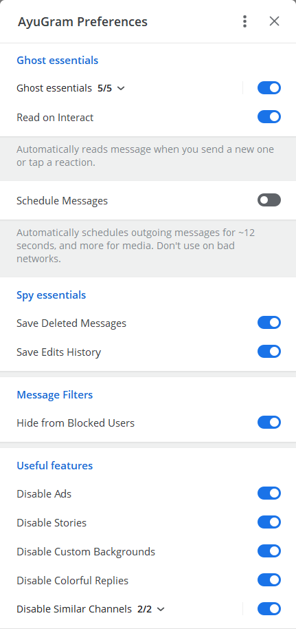
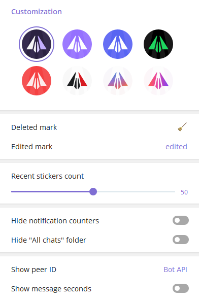
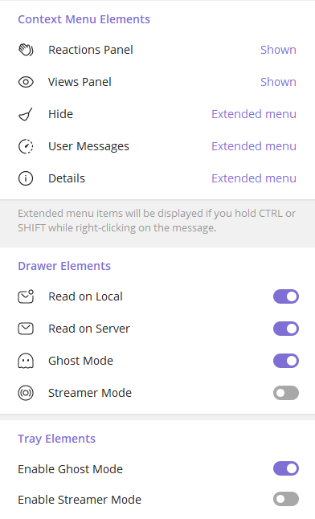
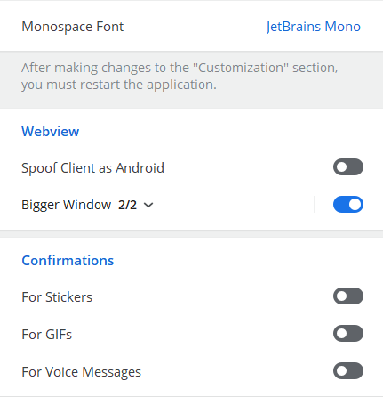

# AyuGram

 

## Features

- Full ghost mode (flexible)
- Messages history
- Anti-recall
- Font customization
- Streamer mode
- Local Telegram Premium
- Enhanced appearance

And many more. Check out our [Documentation](https://docs.ayugram.one/desktop/).

## Preferences screenshots






## Downloads

### Windows

#### Official

You can download prebuilt Windows binary from [Releases tab](https://github.com/AyuGram/AyuGramDesktop/releases) or from
the [Telegram topic](https://t.me/ayugramchat/12788).

#### Winget

```bash
winget install RadolynLabs.AyuGramDesktop
```

#### Scoop

```bash
scoop bucket add extras
scoop install ayugram
```

#### Self-built

Follow [official guide](https://github.com/AyuGram/AyuGramDesktop/blob/dev/docs/building-win-x64.md) if you want to
build by yourself.
>>>>>>> 59e44d4e96 (feat: add scoop note)

### Arch Linux

You can install `ayugram-desktop` or `ayugram-desktop-git` from [AUR](https://aur.archlinux.org/packages?O=0&K=ayugram).

### NixOS

See [this repository](https://github.com/kaeeraa/ayugram-desktop) for installation manual.

### Any other Linux distro

Follow the [official guide](https://github.com/AyuGram/AyuGramDesktop/blob/dev/docs/building-linux.md).

### Remarks for Windows

* Qt 6 ([LGPL](http://doc.qt.io/qt-6/lgpl.html)) and Qt 5.15 ([LGPL](http://doc.qt.io/qt-5/lgpl.html)) slightly patched
* OpenSSL 3.2.1 ([Apache License 2.0](https://www.openssl.org/source/apache-license-2.0.txt))
* WebRTC ([New BSD License](https://github.com/desktop-app/tg_owt/blob/master/LICENSE))
* zlib 1.2.11 ([zlib License](http://www.zlib.net/zlib_license.html))
* LZMA SDK 9.20 ([public domain](http://www.7-zip.org/sdk.html))
* liblzma ([public domain](http://tukaani.org/xz/))
* Google Breakpad ([License](https://chromium.googlesource.com/breakpad/breakpad/+/master/LICENSE))
* Google Crashpad ([Apache License 2.0](https://chromium.googlesource.com/crashpad/crashpad/+/master/LICENSE))
* GYP ([BSD License](https://github.com/bnoordhuis/gyp/blob/master/LICENSE))
* Ninja ([Apache License 2.0](https://github.com/ninja-build/ninja/blob/master/COPYING))
* OpenAL Soft ([LGPL](https://github.com/kcat/openal-soft/blob/master/COPYING))
* Opus codec ([BSD License](http://www.opus-codec.org/license/))
* FFmpeg ([LGPL](https://www.ffmpeg.org/legal.html))
* Guideline Support Library ([MIT License](https://github.com/Microsoft/GSL/blob/master/LICENSE))
* Range-v3 ([Boost License](https://github.com/ericniebler/range-v3/blob/master/LICENSE.txt))
* Open Sans font ([Apache License 2.0](http://www.apache.org/licenses/LICENSE-2.0.html))
* Vazirmatn font ([SIL Open Font License 1.1](https://github.com/rastikerdar/vazirmatn/blob/master/OFL.txt))
* Emoji alpha codes ([MIT License](https://github.com/emojione/emojione/blob/master/extras/alpha-codes/LICENSE.md))
* xxHash ([BSD License](https://github.com/Cyan4973/xxHash/blob/dev/LICENSE))
* QR Code generator ([MIT License](https://github.com/nayuki/QR-Code-generator#license))
* CMake ([New BSD License](https://github.com/Kitware/CMake/blob/master/Copyright.txt))
* Hunspell ([LGPL](https://github.com/hunspell/hunspell/blob/master/COPYING.LESSER))
* Ada ([Apache License 2.0](https://github.com/ada-url/ada/blob/main/LICENSE-APACHE))

## Build instructions

* Windows [(32-bit)][win32] [(64-bit)][win64]
* [macOS][mac]
* [GNU/Linux using Docker][linux]

[//]: # (LINKS)
[telegram]: https://telegram.org
[telegram_desktop]: https://desktop.telegram.org
[telegram_api]: https://core.telegram.org
[telegram_proto]: https://core.telegram.org/mtproto
[license]: LICENSE
[win32]: docs/building-win.md
[win64]: docs/building-win-x64.md
[mac]: docs/building-mac.md
[linux]: docs/building-linux.md
[preview_image]: https://github.com/telegramdesktop/tdesktop/blob/dev/docs/assets/preview.png "Preview of Telegram Desktop"
[preview_image_url]: https://raw.githubusercontent.com/telegramdesktop/tdesktop/dev/docs/assets/preview.png
=======
Make sure you have these components installed with VS Build Tools:

- C++ MFC latest (x86 & x64)
- C++ ATL latest (x86 & x64)
- latest Windows 11 SDK
=======

## Donation

Enjoy using **AyuGram**? Consider sending us a tip!

[Here's available methods.](https://docs.ayugram.one/donate/)

## Credits

### Telegram clients

- [Telegram Desktop](https://github.com/telegramdesktop/tdesktop)
- [Kotatogram](https://github.com/kotatogram/kotatogram-desktop)
- [64Gram](https://github.com/TDesktop-x64/tdesktop)
- [Forkgram](https://github.com/forkgram/tdesktop)

### Libraries used

- [JSON for Modern C++](https://github.com/nlohmann/json)
- [SQLite](https://github.com/sqlite/sqlite)
- [sqlite_orm](https://github.com/fnc12/sqlite_orm)

### Icons

- [Solar Icon Set](https://www.figma.com/community/file/1166831539721848736)
